# Laboratorio 2: GitHub Actions, SonarQube y Azure

**Autor:** Joe Meza
**Fecha:** 09 de septiembre de 2026
**Organizacion:** [company-jmeza](https://github.com/company-jmeza)
**Repositorio:** [ms-nodejs-backend](https://github.com/company-jmeza/ms-nodejs-backend)
**Suscripcion Azure:** `Azure 03`

## Objetivo

Preparar una aplicacion Node.js, validar sus pruebas, desplegar SonarQube en Azure, integrar el analisis de codigo con GitHub Actions y crear un workflow manual de Build y Deploy con parametros.

## Resumen de resultados

| Ejercicio               | Resultado | Evidencia principal                              |
| ----------------------- | --------- | ------------------------------------------------ |
| 1. Node.js y aplicacion | Exitoso   | 4 pruebas unitarias y 5 de integracion           |
| 2. SonarQube en Azure   | Exitoso   | SonarQube Community operativo en una VM temporal |
| 3. Workflow CI          | Exitoso   | Run `34703138819`                                |
| 4. Workflow manual      | Exitoso   | Run `34306318779` con ambiente `qa`              |
| Limpieza de Azure       | Exitoso   | `rg-cicd-sonarqube-jmeza` no existe              |

## Ejercicio 1: Instalar Node y validar la aplicacion

Se utilizo el fork `company-jmeza/ms-nodejs-backend`. El equipo local tenia Node.js `v22.13.0` y npm `10.9.2`; el workflow CI se ejecuto con Node.js 20, como solicita el laboratorio.

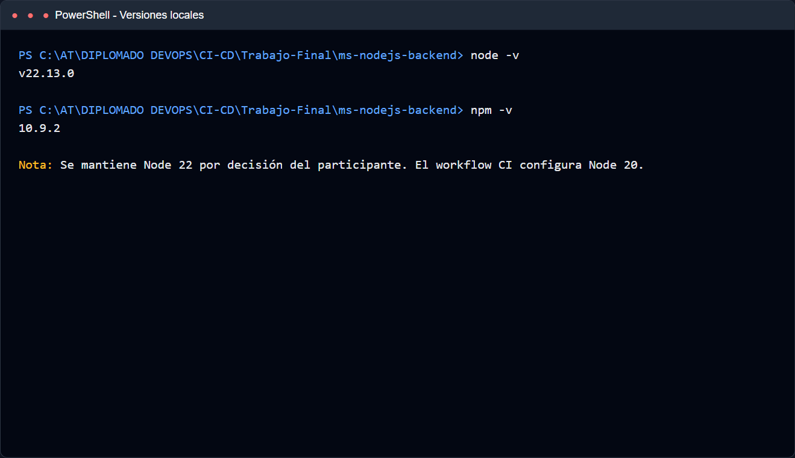

_Figura 1. Versiones de Node.js y npm disponibles localmente._

Se instalaron 470 dependencias con `npm install`. npm reporto 16 vulnerabilidades en dependencias: 1 baja, 3 moderadas y 12 altas. No se aplico `npm audit fix --force` porque puede introducir cambios incompatibles fuera del alcance del laboratorio.

### Pruebas unitarias

El comando `npm run test:unit` completo 4 de 4 pruebas.

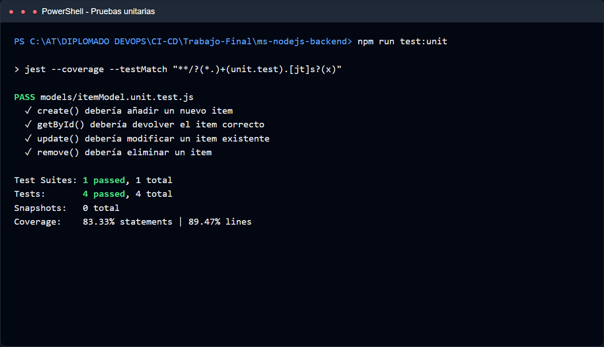

_Figura 2. Ejecucion local de pruebas unitarias._

### Pruebas de integracion

El comando `npm run test:integration` completo 5 de 5 pruebas.

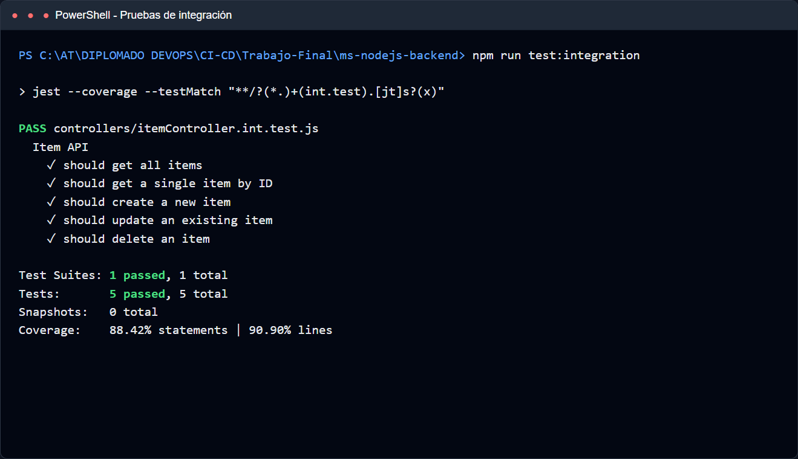

_Figura 3. Ejecucion local de pruebas de integracion._

### Aplicacion y Swagger

La aplicacion se inicio con `node app.js` y la documentacion respondio correctamente en `http://localhost/api-docs/`.

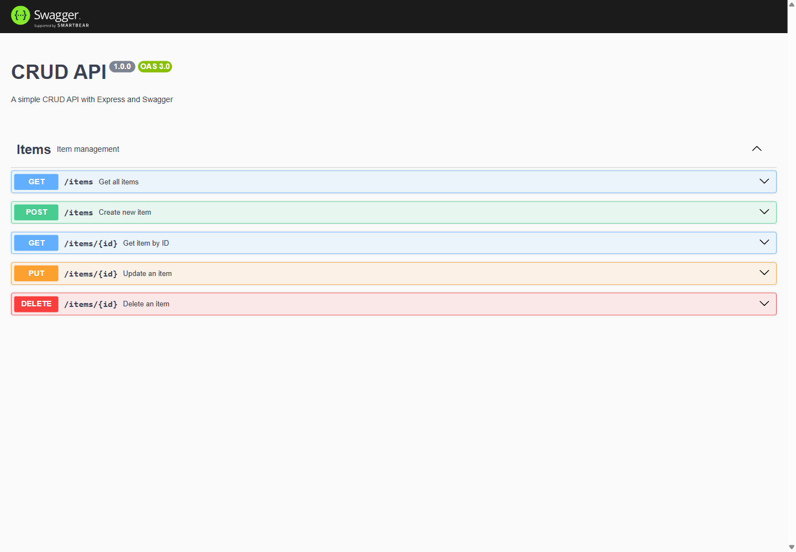

_Figura 4. API Node.js disponible mediante Swagger._

## Ejercicio 2: Instalar y configurar SonarQube

### Azure Cloud Shell

Se ingreso al portal con la cuenta institucional y se selecciono la suscripcion `Azure 03`, identificador `7664be55-774e-45fd-a02c-40627b5a7a58`.

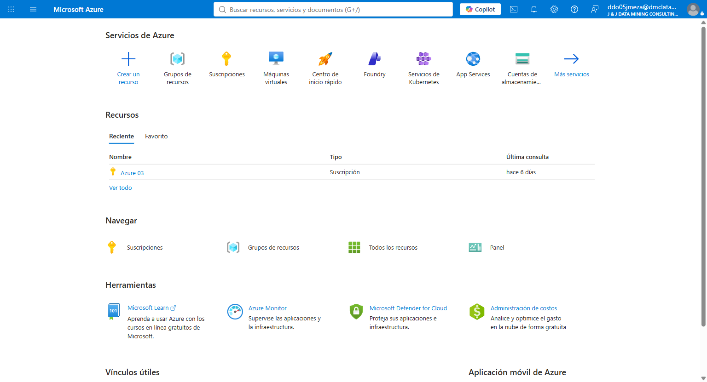

_Figura 5. Cuenta institucional en Microsoft Azure._

Cloud Shell se configuro con Bash y el archivo `sonar.sh` se cargo mediante **Administrar archivos > Cargar**.

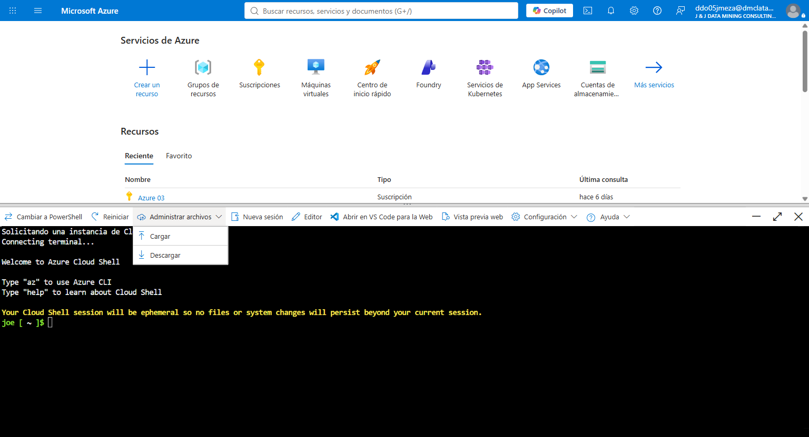

_Figura 6. Cloud Shell Bash y opcion para administrar archivos._

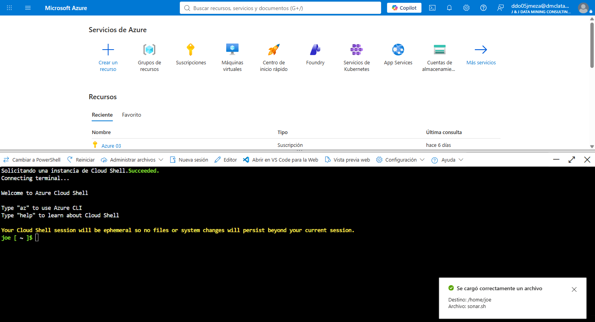

_Figura 7. Confirmacion de carga de `sonar.sh`._

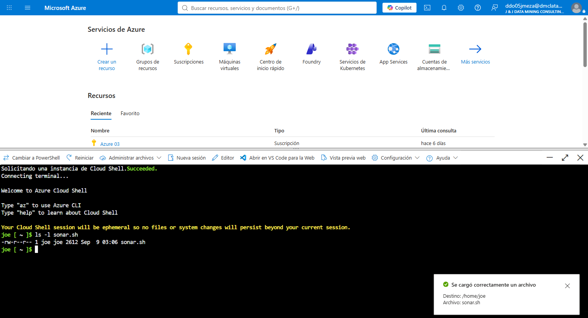

_Figura 8. Archivo disponible en el directorio de Cloud Shell._

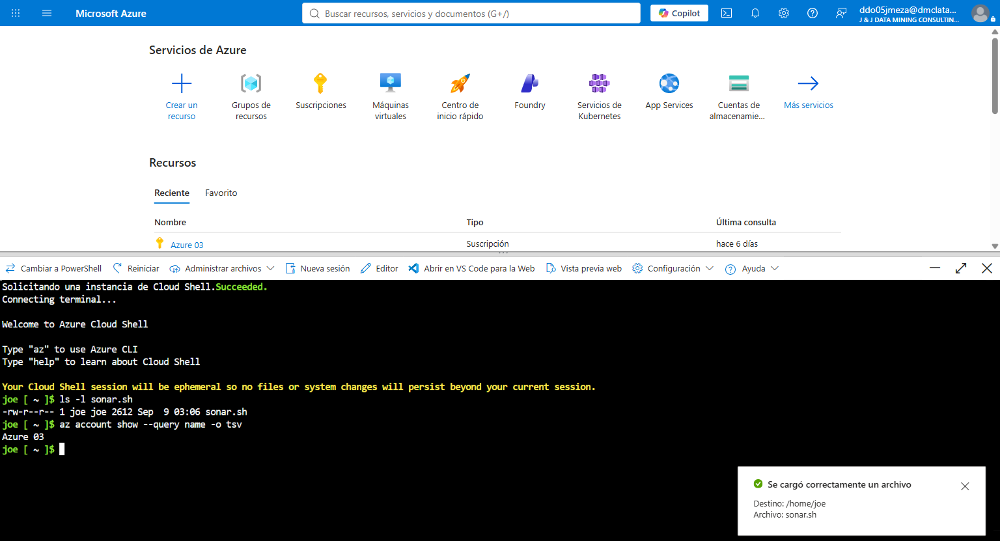

_Figura 9. Suscripcion `Azure 03` seleccionada._

### Despliegue

Una primera ejecucion detecto que la identidad solo tenia permisos sobre un Key Vault. Despues de asignar el acceso requerido, se valido la capacidad para crear el grupo de recursos y se volvio a ejecutar:

```bash
chmod +x sonar.sh
./sonar.sh
```

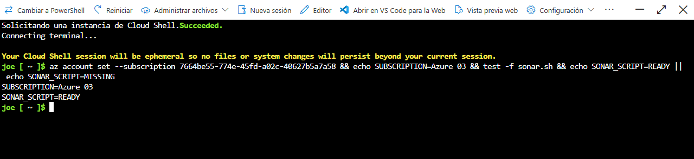

_Figura 10. Suscripcion y script validados antes del despliegue._

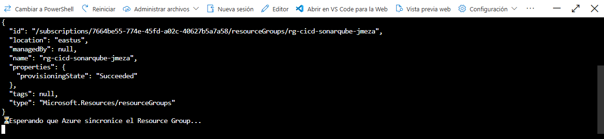

_Figura 11. Creacion del grupo `rg-cicd-sonarqube-jmeza` desde Cloud Shell._

El script creo una VM Ubuntu 22.04 `Standard_D2s_v3`, abrio el puerto 9000 e inicio SonarQube Community mediante Docker Compose. La VM quedo en estado `running` y SonarQube respondio HTTP 200.

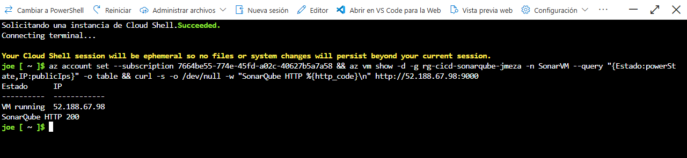

_Figura 12. VM activa, IP publica y respuesta HTTP 200 de SonarQube._

### Token y configuracion de GitHub

Se cambio la contrasena inicial de SonarQube sin registrarla en capturas. En **My Account > Security** se genero el token `github-actions`, de tipo `User Token` y sin expiracion.

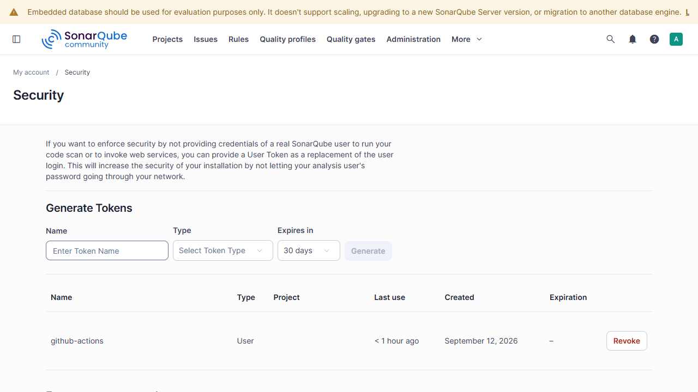

_Figura 13. Token de usuario registrado; su valor no se muestra._

Se configuraron en la organizacion `company-jmeza`:

| Tipo     | Nombre           | Visibilidad            |
| -------- | ---------------- | ---------------------- |
| Secret   | `SONAR_TOKEN`    | Todos los repositorios |
| Variable | `SONAR_HOST_URL` | Todos los repositorios |

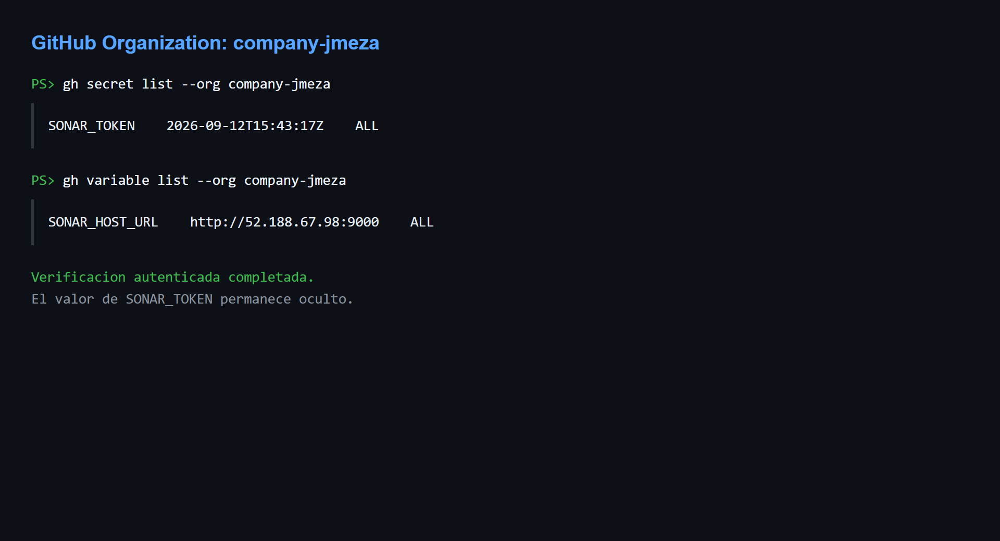

_Figura 14. Verificacion autenticada de secret y variable mediante GitHub CLI._

## Ejercicio 3: Workflow CI

Se creo `.github/workflows/build.yml` y se alineo `sonar-project.properties` con la clave `my-nodejs-app`.

El workflow conserva los pasos solicitados por el material:

1. Obtener codigo fuente y SHA corto.
2. Configurar Node.js 20.
3. Instalar dependencias.
4. Ejecutar pruebas unitarias y de integracion.
5. Crear el proyecto en SonarQube cuando no existe.
6. Ejecutar el analisis SonarQube.
7. Crear y subir el artefacto ZIP.
8. Ejecutar los marcadores pendientes para Registry y Docker.

Se actualizaron las acciones a versiones vigentes y se fijo SonarQube Scan Action en `v8.2.1`. Tambien se corrigio la comprobacion del documento: `/api/projects/search` responde 200 aunque la busqueda no tenga resultados; `/api/components/show` devuelve 404 cuando la clave no existe y permite ejecutar correctamente la rama de creacion.

- Commit: [`9dda5ec`](https://github.com/company-jmeza/ms-nodejs-backend/commit/9dda5ece88be94405222c4aae0ccdf68f04f97c1).
- Run: [`34703138819`](https://github.com/company-jmeza/ms-nodejs-backend/actions/runs/34703138819).
- Job: [`103578323089`](https://github.com/company-jmeza/ms-nodejs-backend/actions/runs/34703138819/job/103578323089).
- Resultado: `Success`.
- Duracion: 52 segundos.

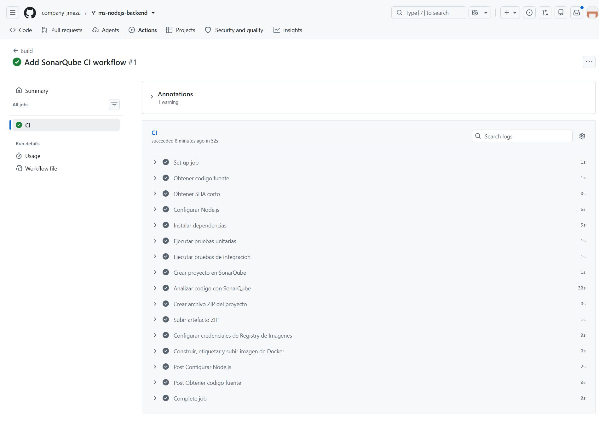

_Figura 15. Job CI con todos los steps completados._

### Validacion de pruebas en CI

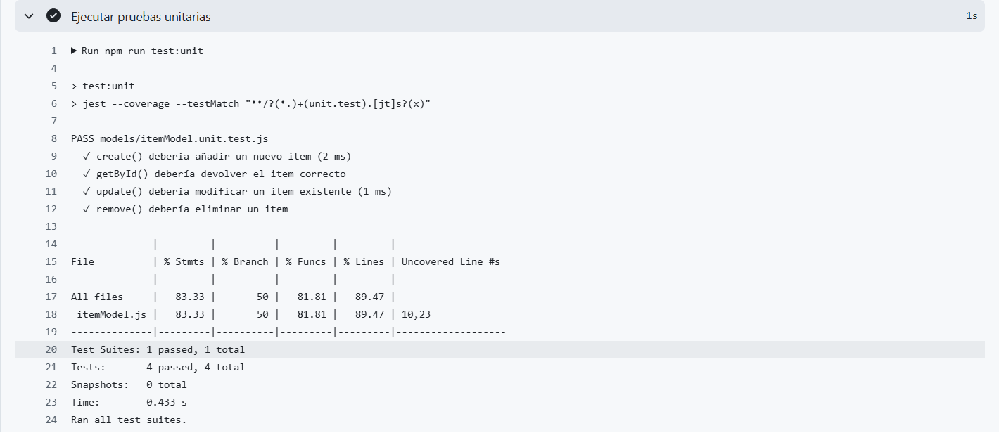

_Figura 16. Cuatro pruebas unitarias aprobadas en GitHub Actions._

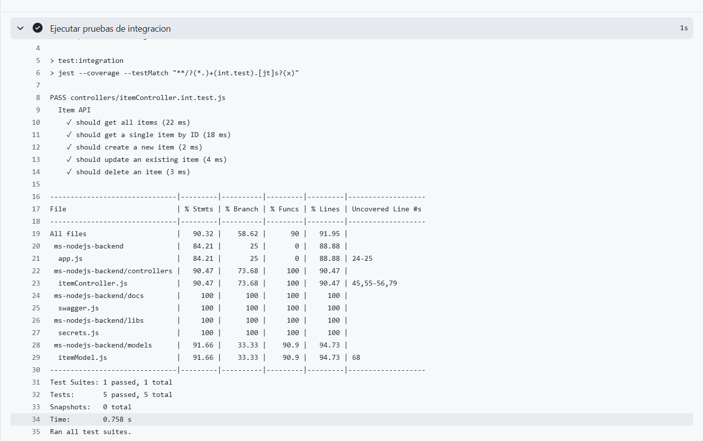

_Figura 17. Cinco pruebas de integracion aprobadas en GitHub Actions._

### Creacion y analisis de SonarQube

Antes del run se comprobo que `my-nodejs-app` devolvia HTTP 404. El step creo realmente el proyecto y SonarQube proceso el commit del workflow.

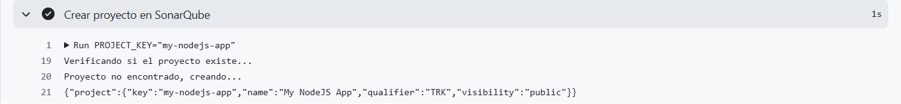

_Figura 18. Rama de creacion ejecutada y proyecto `my-nodejs-app` creado._

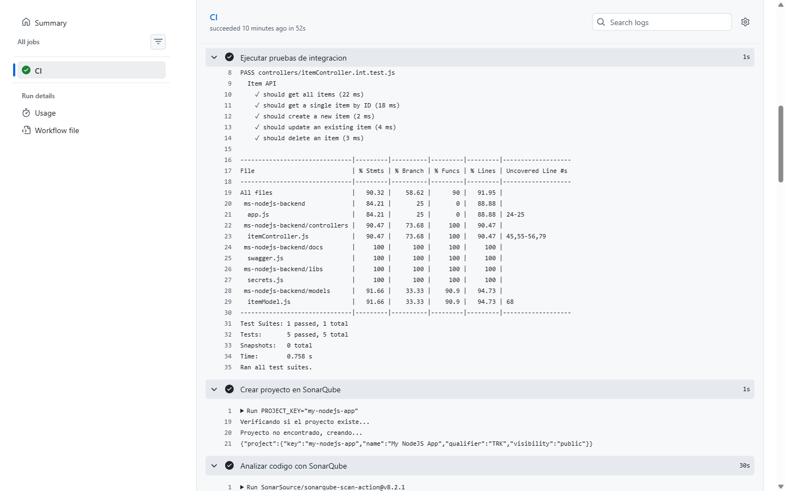

_Figura 19. SonarQube Scan Action `v8.2.1` dentro del job CI._

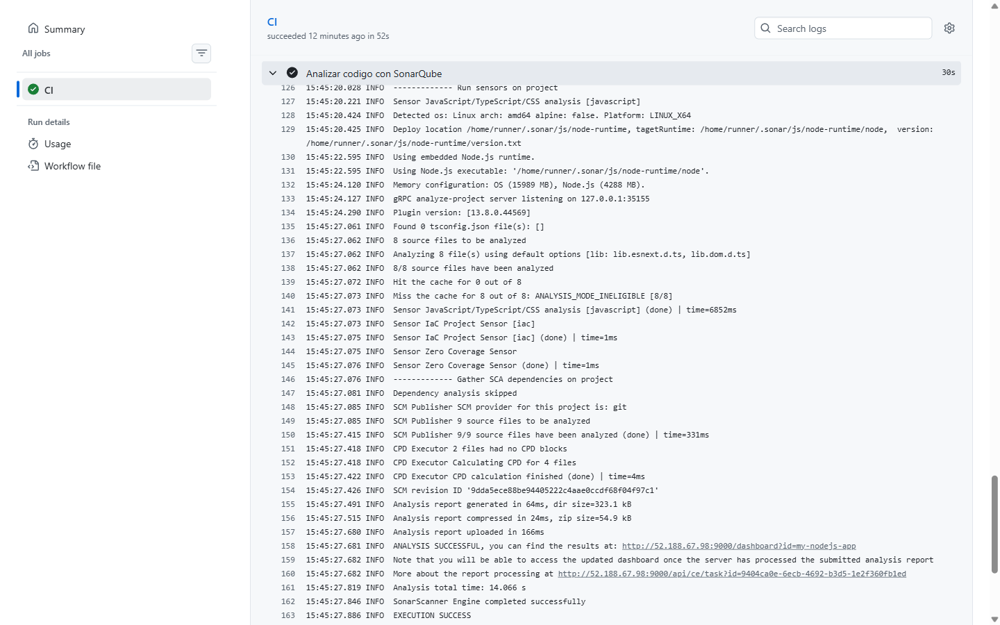

_Figura 20. Resultado `ANALYSIS SUCCESSFUL` y `EXECUTION SUCCESS`._

El dashboard reporto:

| Metrica          |   Resultado |
| ---------------- | ----------: |
| Quality Gate     | Passed / OK |
| Cobertura        |       76.9% |
| Bugs             |           0 |
| Vulnerabilidades |           3 |
| Code Smells      |           1 |
| Duplicacion      |        0.0% |
| Lineas de codigo |         172 |

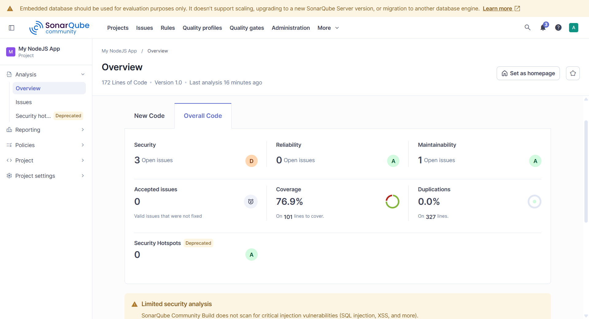

_Figura 21. Metricas del analisis de `My NodeJS App`._

### Artefacto

El workflow creo `build-artifact.zip` sin `node_modules` ni `.git` y lo publico como artefacto de GitHub Actions.

- Nombre: `build-artifact`.
- Tamano final: 151,669 bytes.
- Artifact ID: `10300606646`.

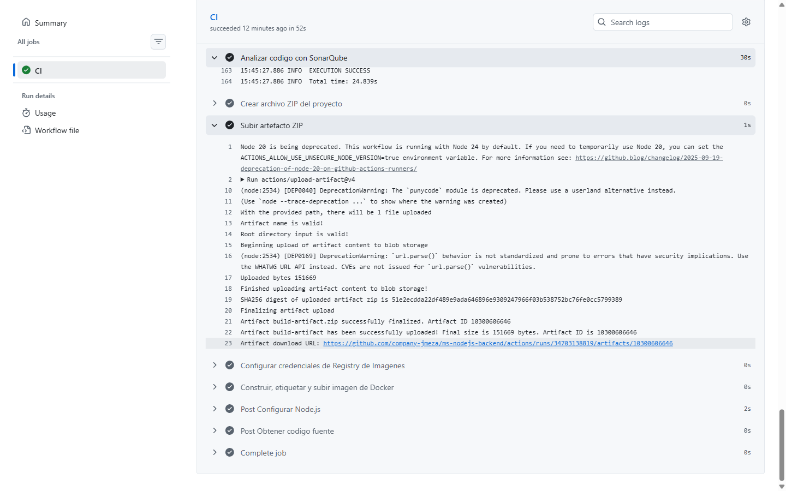

_Figura 22. Artefacto finalizado y disponible para descarga._

## Ejercicio 4: Workflow manual Build y Deploy

Se creo `.github/workflows/build-deploy-flow.yaml` con `workflow_dispatch` y los parametros:

| Parametro           | Tipo   | Valores de prueba                   |
| ------------------- | ------ | ----------------------------------- |
| `ambiente`          | Choice | `dev`, `qa`, `prd`; se ejecuto `qa` |
| `nombre_aplicacion` | String | `ms-nodejs-backend`                 |

El job `Deploy` depende de `Build` mediante `needs: build`.

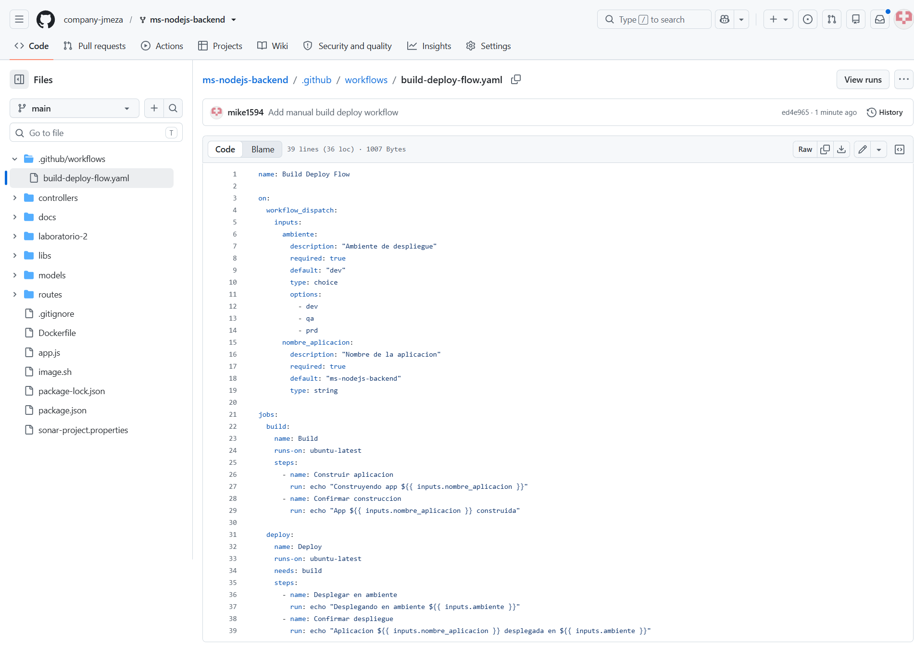

_Figura 23. Workflow manual Build Deploy Flow._

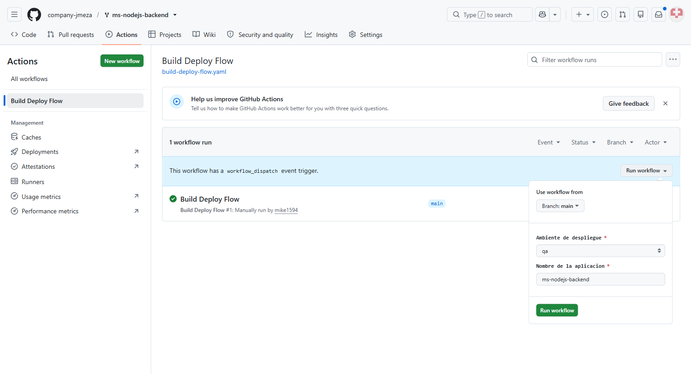

_Figura 24. Parametros utilizados en la ejecucion manual._

- Run: [`34306318779`](https://github.com/company-jmeza/ms-nodejs-backend/actions/runs/34306318779).
- Ambiente: `qa`.
- Aplicacion: `ms-nodejs-backend`.
- Jobs: Build y Deploy completados correctamente.

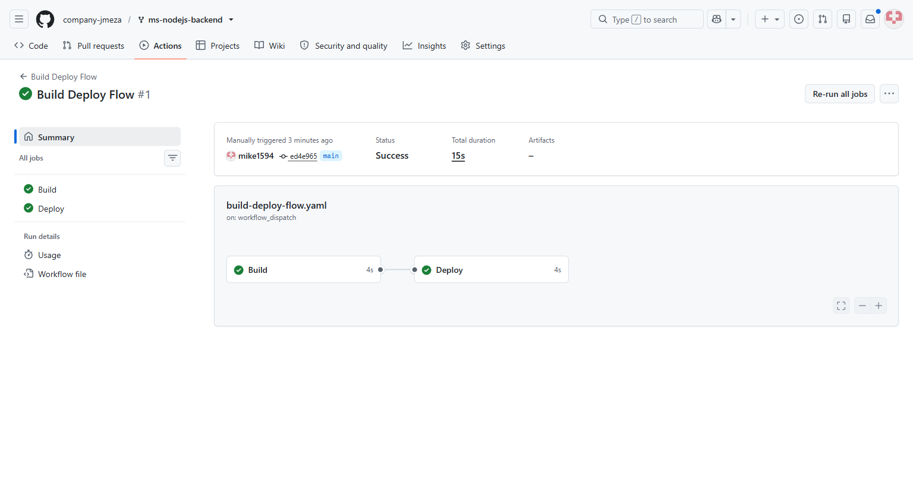

_Figura 25. Secuencia Build seguida por Deploy._

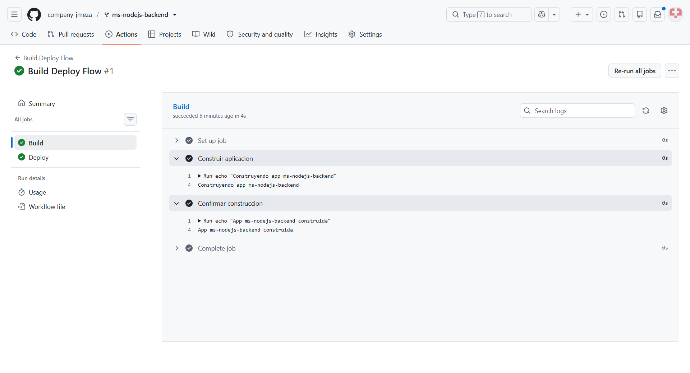

_Figura 26. Mensajes de construccion del job Build._

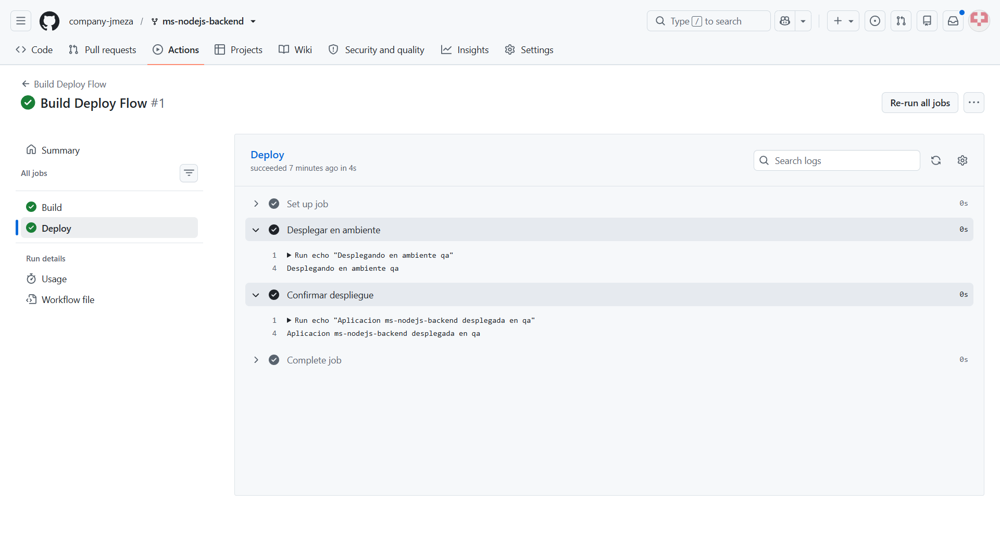

_Figura 27. Mensajes de despliegue en el ambiente `qa`._

## Limpieza de Azure

Despues de capturar el dashboard y validar el workflow, se elimino el grupo de recursos `rg-cicd-sonarqube-jmeza`. La comprobacion final desde Azure Cloud Shell devolvio `false`, por lo que la VM, IP publica, disco y recursos asociados dejaron de generar costos.

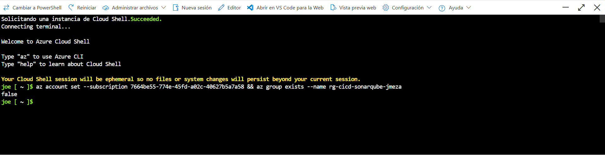

_Figura 28. Verificacion final de que el grupo de recursos no existe._

Los nombres `SONAR_TOKEN` y `SONAR_HOST_URL` se mantienen en la organizacion como solicita el laboratorio. Tras eliminar la VM, sus valores quedan como referencia historica y no permiten conectarse al servidor eliminado.

## Conclusiones

- Las 9 pruebas automatizadas se ejecutaron correctamente tanto localmente como en GitHub Actions.
- El workflow CI creo el proyecto, envio la cobertura y completo el analisis con Quality Gate aprobado.
- El uso de secretos y variables organizacionales evito registrar el token en el repositorio o en los logs.
- El workflow manual demostro parametros y dependencia entre Build y Deploy.
- Los recursos temporales de Azure fueron eliminados al finalizar para evitar costos.
