# Laboratorio 4: Integracion y Despliegue Continuo en Azure

**Autor:** Joe Meza
**Fecha:** 12 de septiembre de 2026
**Organizacion:** [company-jmeza](https://github.com/company-jmeza)
**Repositorio:** [ms-nodejs-backend](https://github.com/company-jmeza/ms-nodejs-backend)
**Suscripcion Azure:** `Azure 03`
**Region:** `West US`

## Objetivo

Implementar un flujo de integracion y despliegue continuo para una aplicacion Node.js. El flujo debe ejecutar pruebas, generar un artefacto, construir una imagen Docker, publicarla en Azure Container Registry y desplegar la misma version de la imagen en Azure Container Apps para los ambientes `dev`, `qa` y `prd`, con aprobaciones manuales antes de promover a `qa` y `prd`.

## Ejercicio N° 1 - Configuracion de ambiente y despliegue

### Resumen de resultados

| Actividad | Resultado | Evidencia |
| --- | --- | --- |
| Pruebas unitarias | Exitoso | 4 de 4 pruebas aprobadas |
| Pruebas de integracion | Exitoso | 5 de 5 pruebas aprobadas |
| Artefacto ZIP | Exitoso | `build-artifact`, 3.95 MB |
| Imagen Docker | Exitoso | `my-nodejs-app:f81e405` |
| Despliegue `dev` | Exitoso | HTTP 200 en `/api/items` |
| Aprobacion y despliegue `qa` | Exitoso | Aprobado por `mike1594` y HTTP 200 |
| Aprobacion y despliegue `prd` | Exitoso | Aprobado por `mike1594` y HTTP 200 |
| Pipeline completo | Exitoso | Run `34708867118`, duracion 4 min 48 s |

### 1. Infraestructura y configuracion previa

El Laboratorio 3 dejo preparados los recursos y controles requeridos por el flujo de CD:

- Grupo de recursos `rg-cicd-terraform-app-jmeza`.
- Azure Container Registry `acrjmeza` con SKU Basic.
- Container Apps `aca-ms-jmeza-dev`, `aca-ms-jmeza-qa` y `aca-ms-jmeza-prd`.
- Identidad administrada asignada por el sistema en cada Container App.
- Rol `AcrPull` para que cada identidad pueda obtener imagenes desde ACR.
- Secret organizacional `AZURE_CREDENTIALS`.
- Variable organizacional `APELLIDO=jmeza`.
- Ambientes GitHub `dev`, `qa`, `prd`, `approval-qa` y `approval-prd`.
- Variables `ENV` y `API_PROVIDER_URL` definidas por ambiente.
- Revisores requeridos en `approval-qa` y `approval-prd`.

Los valores de `API_PROVIDER_URL` usados fueron:

| Ambiente | `ENV` | `API_PROVIDER_URL` |
| --- | --- | --- |
| Desarrollo | `dev` | `https://dev.api.com` |
| Calidad | `qa` | `https://qa.api.com` |
| Produccion | `prd` | `https://api.com` |

### 2. Implementacion del workflow

Se activo `.github/workflows/main.yml` con disparador `push` sobre la rama `main`. El workflow anterior de SonarQube fue retirado de `.github/workflows` y conservado como evidencia en `laboratorio-2/archivo/build-sonarqube.yml`; esto evita ejecutar un analisis contra la VM de SonarQube que ya habia sido eliminada.

El workflow activo contiene seis jobs secuenciales:

| Orden | Job | Ambiente GitHub | Proposito |
| ---: | --- | --- | --- |
| 1 | `CI` | `dev` | Probar, generar ZIP, construir y publicar imagen |
| 2 | `CD [dev]` | `dev` | Desplegar la imagen en desarrollo |
| 3 | `approval-qa` | `approval-qa` | Solicitar aprobacion para calidad |
| 4 | `CD [qa]` | `qa` | Desplegar la misma imagen en calidad |
| 5 | `approval-prd` | `approval-prd` | Solicitar aprobacion para produccion |
| 6 | `CD [prd]` | `prd` | Desplegar la misma imagen en produccion |

La version de la imagen se obtiene del SHA corto del commit:

```bash
echo "short_sha=$(git rev-parse --short $GITHUB_SHA)" >> "$GITHUB_OUTPUT"
```

El commit que activo el pipeline fue [`f81e405`](https://github.com/company-jmeza/ms-nodejs-backend/commit/f81e4058022db7225047f734d6f950942f24bc6f), con el mensaje `Add Azure Container Apps CD workflow`.

### 3. Integracion continua y publicacion de imagen

El job `CI` completo correctamente los siguientes pasos:

1. Checkout del repositorio y calculo del SHA corto.
2. Configuracion de Node.js 20.
3. Instalacion de dependencias con npm.
4. Ejecucion de 4 pruebas unitarias.
5. Ejecucion de 5 pruebas de integracion.
6. Creacion y carga de `build-artifact.zip`.
7. Autenticacion en Azure y ACR.
8. Construccion y publicacion de la imagen Docker.

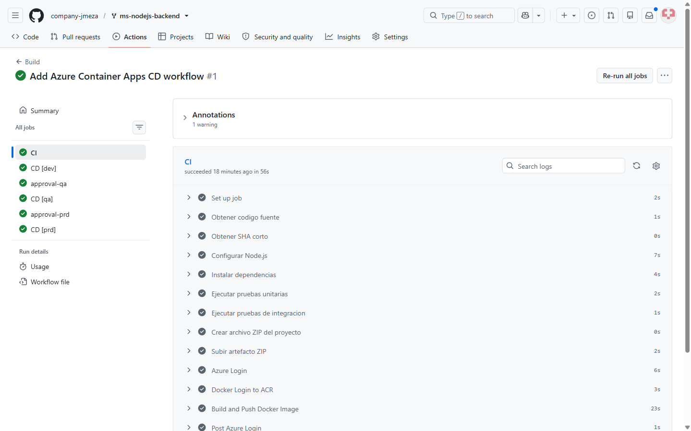

_Figura 1. Job CI exitoso con pruebas, artefacto, autenticacion ACR y publicacion de imagen._

El workflow produjo el artefacto `build-artifact`, con un tamano visible de 3.95 MB en el resumen del run.

La imagen publicada fue:

```text
acrjmeza.azurecr.io/my-nodejs-app:f81e405
```

Azure Container Registry registro un manifiesto Linux `amd64` de 135,566,884 bytes y digest:

```text
sha256:d106b417ac490d7b26baee15a56b505084b99a51ebf910dbcc309758c4a3abb3
```

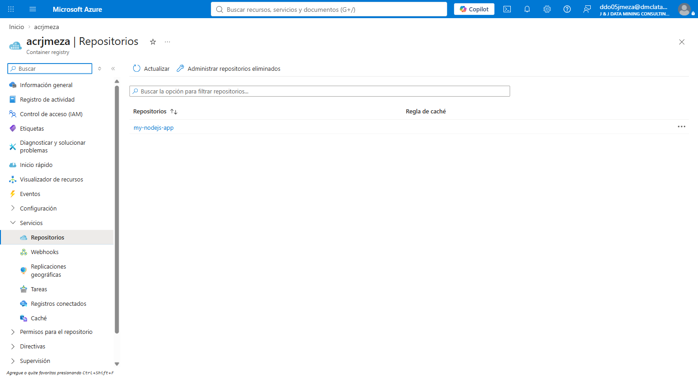

_Figura 2. Repositorio `my-nodejs-app` creado en `acrjmeza`._

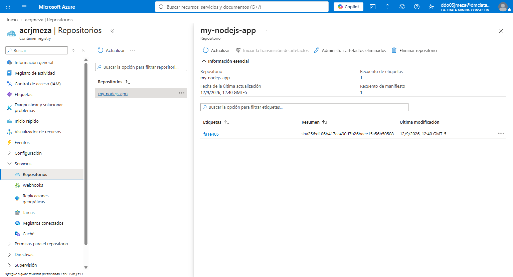

_Figura 3. Tag inmutable `f81e405` publicado en Azure Container Registry._

### 4. Despliegue en desarrollo

Al terminar `CI`, el job `CD [dev]` configuro el acceso de `aca-ms-jmeza-dev` al registro mediante su identidad administrada y actualizo la aplicacion con la imagen `f81e405`.

El despliegue finalizo correctamente antes de solicitar la promocion a calidad. En ese punto GitHub Actions detuvo el flujo y mostro el boton **Review deployments**.

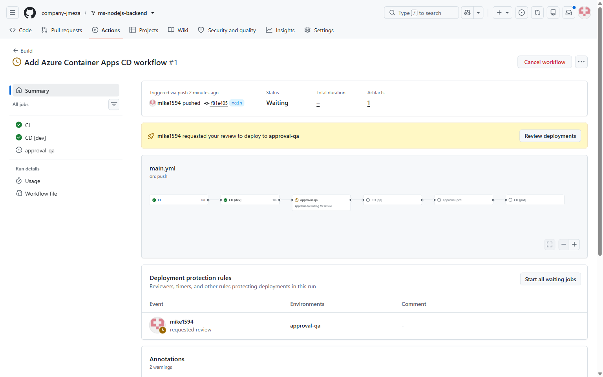

_Figura 4. CI y CD de desarrollo completados; el pipeline espera aprobacion para `qa`._

La API desplegada en desarrollo respondio HTTP 200 y expuso en sus metadatos el proveedor `https://dev.api.com`.

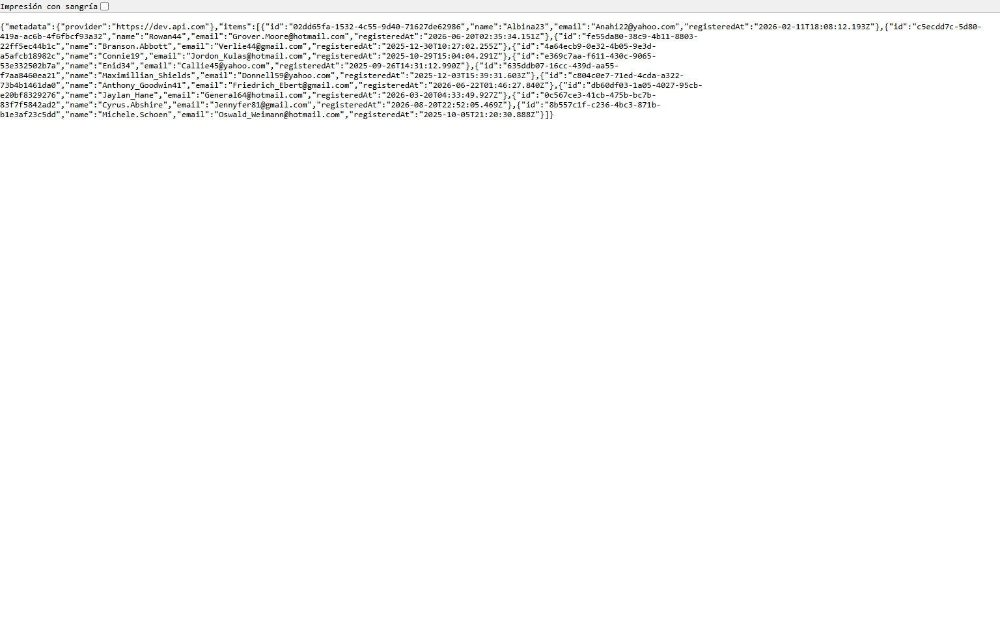

_Figura 5. Respuesta de `/api/items` en el ambiente `dev`._

### 5. Aprobacion y despliegue en calidad

El ambiente protegido `approval-qa` solicito revision manual. El usuario `mike1594` aprobo la promocion y GitHub habilito el job `CD [qa]`.

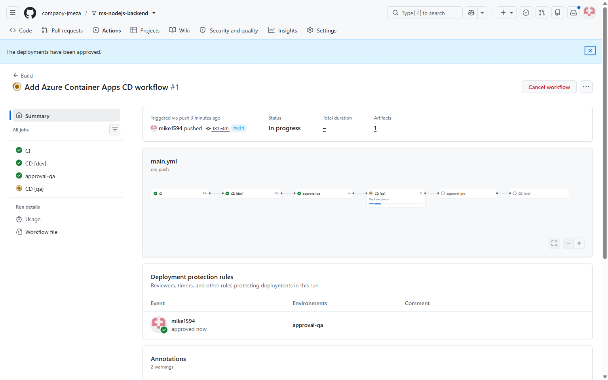

_Figura 6. Aprobacion de `approval-qa` y ejecucion del despliegue de calidad._

La aplicacion de calidad quedo en estado **En ejecucion** dentro de Azure Container Apps.

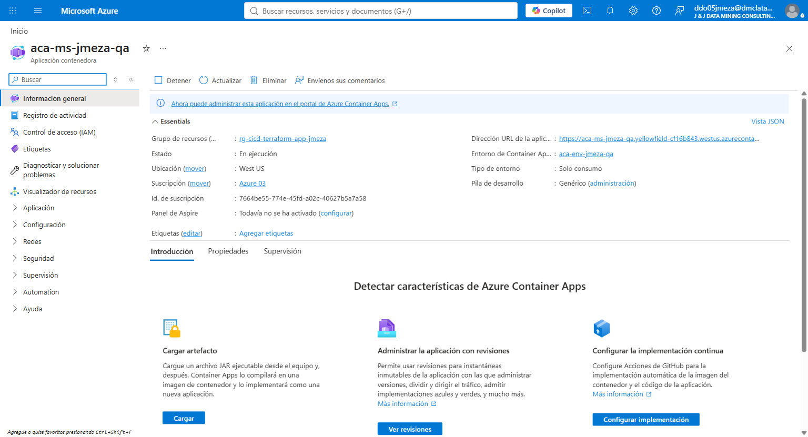

_Figura 7. Informacion general de `aca-ms-jmeza-qa` en Azure._

La revision activa `aca-ms-jmeza-qa--0000001` recibio el 100% del trafico. El escalado a cero observado en el portal es el comportamiento normal del plan de consumo cuando no existen solicitudes.

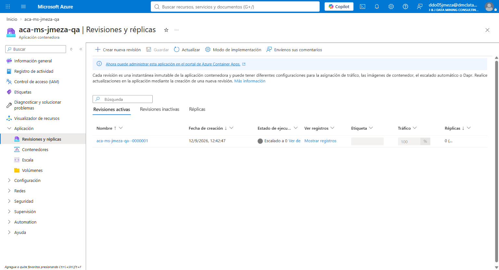

_Figura 8. Revision activa de calidad configurada con 100% del trafico._

El registro de la Container App utiliza Azure Container Registry e identidad administrada asignada por el sistema; no se habilitaron credenciales administrativas del ACR.

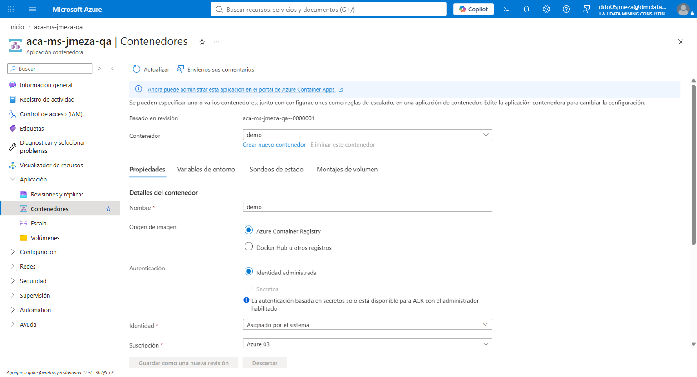

_Figura 9. Configuracion de ACR mediante identidad administrada en `aca-ms-jmeza-qa`._

La API de calidad respondio HTTP 200 y mostro el proveedor `https://qa.api.com`.

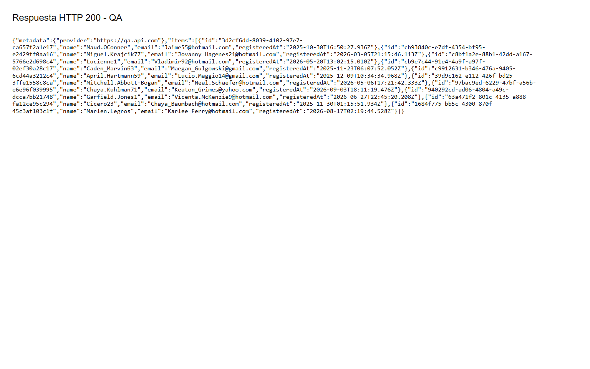

_Figura 10. Respuesta de `/api/items` en el ambiente `qa`._

### 6. Aprobacion y despliegue en produccion

Despues del despliegue de calidad, GitHub Actions solicito la aprobacion del ambiente `approval-prd`. El usuario `mike1594` aprobo la promocion y el job `CD [prd]` completo todos sus pasos.

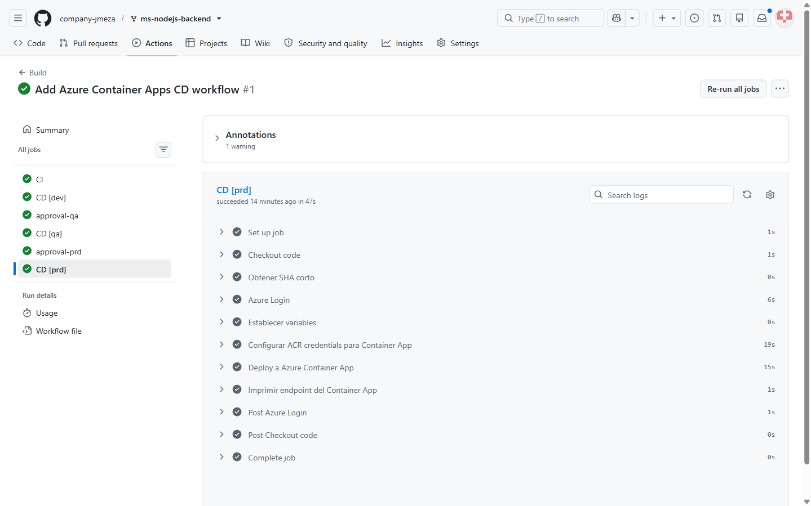

_Figura 11. Despliegue de produccion completado correctamente._

La API de produccion respondio HTTP 200 y mostro el proveedor `https://api.com`.

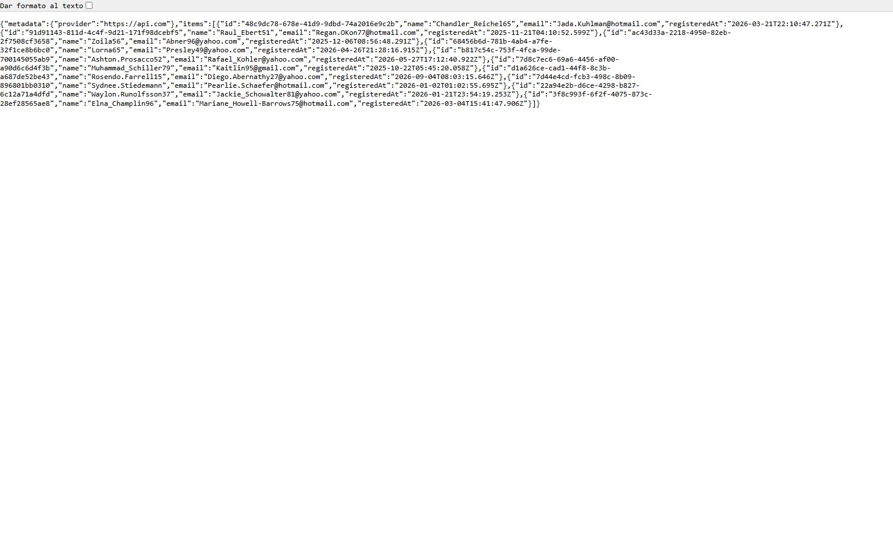

_Figura 12. Respuesta de `/api/items` en el ambiente `prd`._

### 7. Resultado integral del pipeline

El run [`34708867118`](https://github.com/company-jmeza/ms-nodejs-backend/actions/runs/34708867118) finalizo con resultado `Success` y duracion total de 4 minutos 48 segundos.

| Job | Resultado | Duracion |
| --- | --- | ---: |
| `CI` | Success | 56 s |
| `CD [dev]` | Success | 43 s |
| `approval-qa` | Success | 4 s |
| `CD [qa]` | Success | 40 s |
| `approval-prd` | Success | 3 s |
| `CD [prd]` | Success | 47 s |

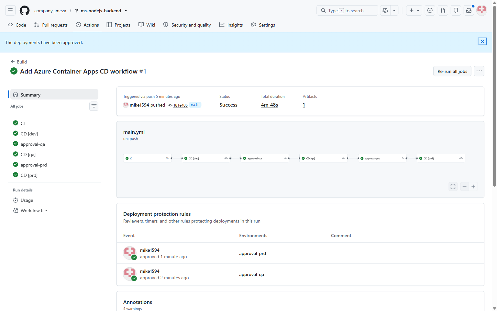

_Figura 13. Cadena CI/CD completa con los seis jobs exitosos._

La seccion **Deployment protection rules** conserva la trazabilidad de las dos decisiones manuales realizadas por `mike1594`.

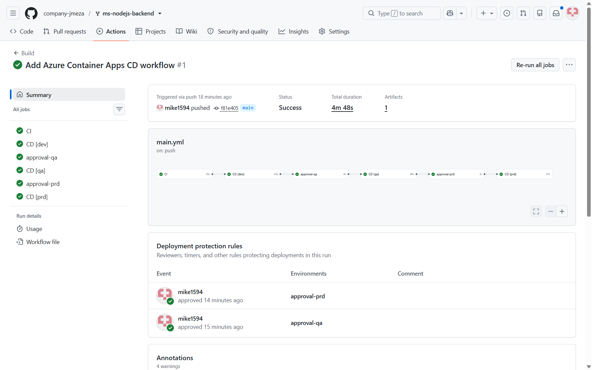

_Figura 14. Registro de aprobaciones para `approval-qa` y `approval-prd`._

### 8. Validacion final

Antes de iniciar la limpieza se consultaron los tres recursos con Azure CLI. Los tres se encontraban en estado `Running`, usaban la revision `0000001` y apuntaban exactamente a `acrjmeza.azurecr.io/my-nodejs-app:f81e405`.

| Container App | Revision lista | Imagen | Endpoint validado |
| --- | --- | --- | --- |
| `aca-ms-jmeza-dev` | `aca-ms-jmeza-dev--0000001` | `my-nodejs-app:f81e405` | `/api/items` HTTP 200 |
| `aca-ms-jmeza-qa` | `aca-ms-jmeza-qa--0000001` | `my-nodejs-app:f81e405` | `/api/items` HTTP 200 |
| `aca-ms-jmeza-prd` | `aca-ms-jmeza-prd--0000001` | `my-nodejs-app:f81e405` | `/api/items` HTTP 200 |

La ruta raiz `/` devuelve HTTP 404 porque la aplicacion no define ese endpoint. Esta respuesta no representa una falla del despliegue; la ruta funcional solicitada y validada es `/api/items`.

## Conclusiones

El laboratorio implemento una cadena CI/CD funcional y trazable. Un unico commit genero una imagen identificable por SHA, la publico en ACR y promovio exactamente la misma version por desarrollo, calidad y produccion. Las compuertas de GitHub Environments impidieron que `qa` y `prd` avanzaran sin aprobacion, mientras que las identidades administradas evitaron almacenar credenciales del registro en la aplicacion.

Las pruebas, el artefacto, la imagen, las aprobaciones, las revisiones y los endpoints quedaron registrados mediante enlaces y capturas. Con esto se verifico tanto el flujo automatizado como el resultado operativo de la aplicacion en Azure.
